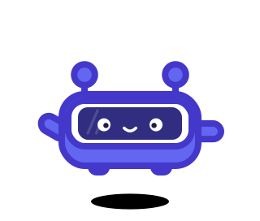
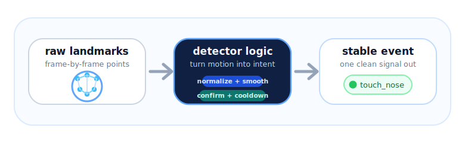
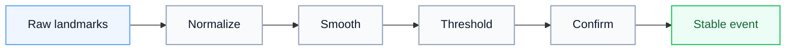

# mediapipe-gesture-signals

<p align="center">
  
  
  
  
  
</p>

<p align="center"></p>

<p align="center"><strong>Raw landmarks in. Stable gesture events out.</strong></p>

<p align="center"><em>A small Python toolkit that turns MediaPipe landmarks into reusable gesture signals for real-time apps.</em></p>

<p align="center"></p>

## The Gesture Layer

MediaPipe already solves **landmark detection**. This repo focuses on the layer above it - turning moving landmark points into **stable gesture events**.

Instead of raw coordinates every frame, your app receives signals like

`touch_nose` · `pinch` · `nod` · `shake_head`

Small detectors. Readable logic. Stable results.

**Start fast:** [Touch nose demo](examples/02-touch-nose-demo/README.md) · [Head gestures demo](examples/03-head-gestures-demo/README.md) · [Thresholds guide](docs/03-thresholds-smoothing-cooldowns.md)

## Quick Navigation

### Learn by Gesture


- **[Touch nose](detectors/face_hand/touch_nose.py)**: start here if you want the clearest visual tuning path in the repo. Open the [demo](examples/02-touch-nose-demo/README.md) for the fastest way to understand it.

- **Head gestures**: use [nod](detectors/face/nod.py), [shake_head](detectors/face/shake_head.py), and [tilt](detectors/face/tilt.py) together, then open the [head gestures demo](examples/03-head-gestures-demo/README.md) to learn the full set in one place.

- **[Pinch](detectors/hand/pinch.py)**: compact hand confirm gesture reused in the [game input demo](examples/04-game-input-demo/README.md).

- **[Finger touch](detectors/hand/finger_touch.py)**: hand-only touch cluster detector that is easiest to inspect in the [basic event logger](examples/01-basic-event-logger/README.md).

- **[Touch head](detectors/pose_hand/touch_head.py)**: pose + hand gesture used as a reset-style action in the [game input demo](examples/04-game-input-demo/README.md).

### Core Concepts


- [Thresholds, smoothing, and cooldowns](docs/03-thresholds-smoothing-cooldowns.md) -> the main tuning guide
- [Event vs state](docs/04-event-vs-state.md) -> when a gesture should fire once versus stay active
- [Common failure modes](docs/05-common-failure-modes.md) -> why gesture systems usually feel noisy or repetitive

### Runnable Demos


1. [Basic event logger](examples/01-basic-event-logger/README.md) -> run all launch-scope detectors together
2. [Touch nose demo](examples/02-touch-nose-demo/README.md) -> inspect one detector visually
3. [Head gestures demo](examples/03-head-gestures-demo/README.md) -> compare event and state behavior
4. [Game input demo](examples/04-game-input-demo/README.md) -> map gestures to simple app-like actions

## Signal Flow



That is the whole idea. Keep the detector logic readable, confirm intent across frames, and emit one stable result your app can trust.

## Setup

```bash
python3.11 -m venv .venv
source .venv/bin/activate
pip install -r requirements.txt
```

Model assets are already bundled for the launch demos, and the pose path uses MediaPipe's built-in pose solution.

## Run the Demos

```bash
source .venv/bin/activate
python examples/01-basic-event-logger/main.py
python examples/02-touch-nose-demo/main.py
python examples/03-head-gestures-demo/main.py
python examples/04-game-input-demo/main.py
```

## Contributing

See [CONTRIBUTING.md](CONTRIBUTING.md).
